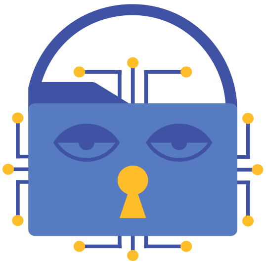
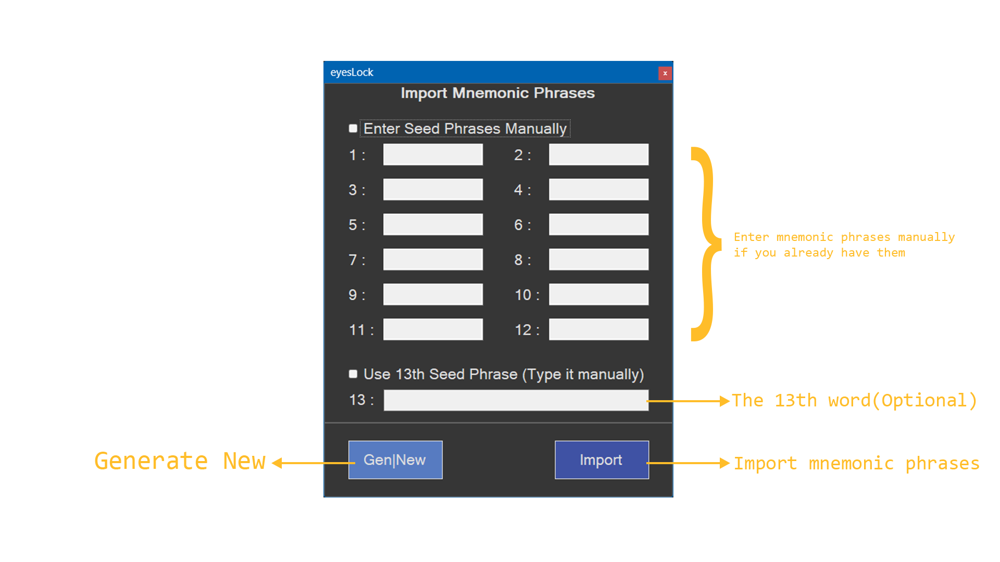
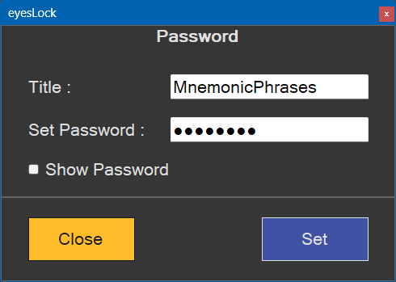
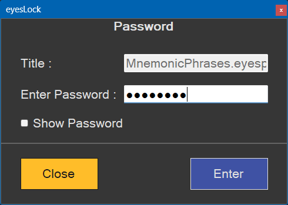
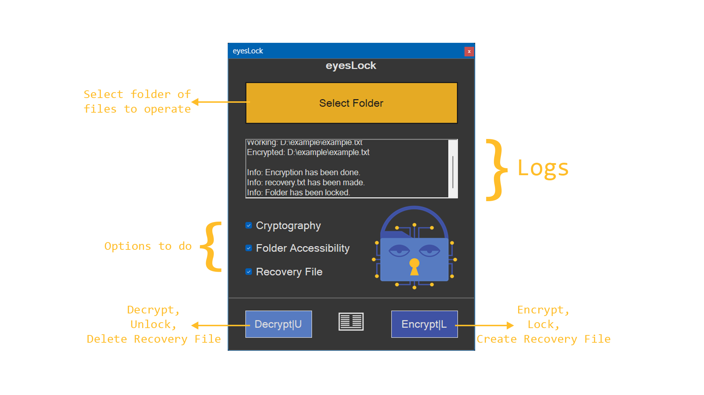
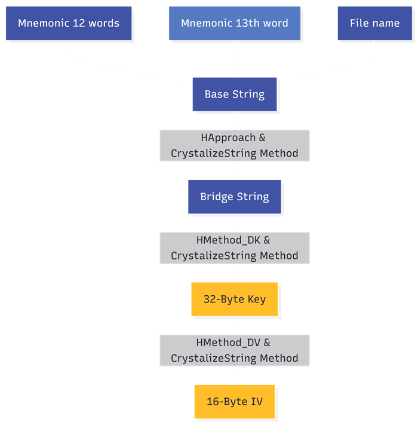
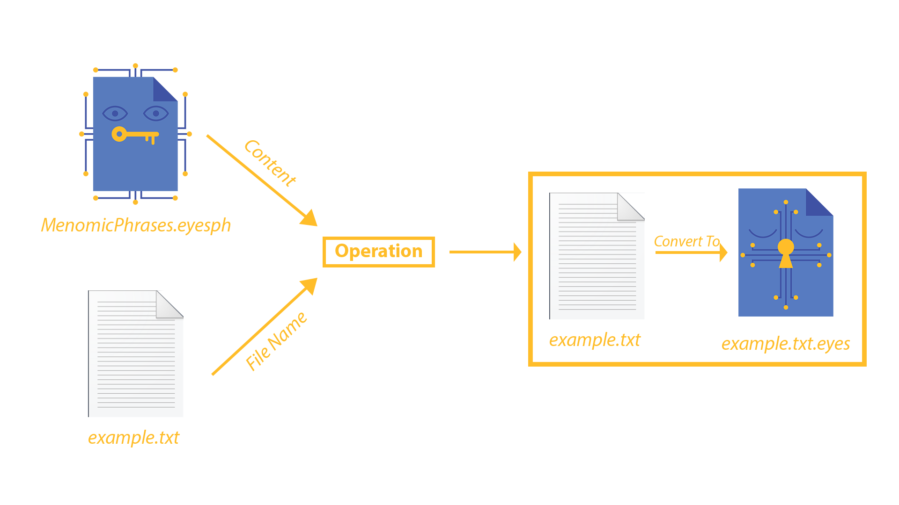
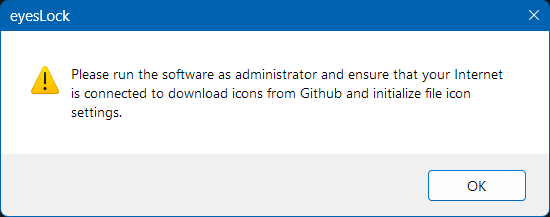

# eysLock

**A file encryptor software that uses a different method of handling keys.**

## What is eyesLock?

**eyesLock** is a file encryptor software which uses two parameters - [mnemonic phrases](#2-mnemonic-phrases) and file name - in several methods to generate 32-Byte(32-character) key for each file. Unlike <ins>7zip and Winrar</ins>, you do NOT need to memorize different tough passwords; The software processes keys in a safe way inside the RAM to encrypt files through AES256([CBC](https://en.wikipedia.org/wiki/Block_cipher_mode_of_operation#Cipher_block_chaining_(CBC))) algorithm. It also uses a completely different 32-Byte key for each file which is unguessable. 
The software does NOT save keys on your hard disk or SSD, it handles keys inside the RAM, and after each process, the key will be DEALLOCATED from the RAM. The only thing that is saved on your disk is a `.eyesph` file which consists of your [mnemonic phrases](#2-mnemonic-phrases). Different keys are generated from the words in this file. The content of the `.eyesph` file is encrypted using a password(key) that is set by **user**, i.e., the only thing that you have to memorize is the [mnemonic phrases](#2-mnemonic-phrases). Additionally, you must recall the password which you have set for the `.eyesph` file to log into the software any time you run it. You are able to change the password whenever you want. However, the password is NOT related to generating keys. It is only for protecting your [mnemonic phrases](#2-mnemonic-phrases) - as similar as <ins>what Bitcoin wallets do.</ins>

### Features

- It uses AES256([CBC](https://en.wikipedia.org/wiki/Block_cipher_mode_of_operation#Cipher_block_chaining_(CBC))) cryptography.

- It facilitates key management.

- You do NOT need to memorize various keys(passwords) for each file.

- 32-Byte keys are generated based on your [mnemonic phrases](#2-mnemonic-phrases) and file name.

- Keys are generated inside the RAM memory.

- **eyesLock** does NOT save keys on your disk.

- Keys are completely different for each file.

- The 32-Byte keys consist of letters, numbers, and symbols.

- It is impossible to crack keys.

- Your [mnemonic phrases](#2-mnemonic-phrases) are encrypted and secured using the password you have chosen in a `.eyesph` file.

## How to use **eyesLock** windows application

### 1. Run

Run the software(as administrator).

### 2. Mnemonic phrases

If you do not have mnemonic phrases to enter manually, click on "Gen|New" button to generate 12 words from [Bip0039 list](https://github.com/bitcoin/bips/blob/master/bip-0039/english.txt). Then, click on "Import" button.

- You can also enter the 13th word manually to make your mnemonic phrases more secure and complex.

<picture>
  <source media="(prefers-color-scheme: light)" srcset="assets/LightMode-Form-Import-Mnemonic-Phrases.png">
  
</picture>

### 3. Set Password

Set title and password for the mnemonic phrases. This will write your mnemonic phrases in a `.eyesph` file which is secured and encrypted by the chosen password.

<picture>
  <source media="(prefers-color-scheme: light)" srcset="assets/LightMode-Form-Password-Set.png">
  
</picture>

**The encrypted mnemonic phrases in a `eyesph` file that is located in the folder of the application.**

- Now you have a `.eyesph` file which different keys are generated from it, and you can use it for your all files.

<picture>
  <source media="(prefers-color-scheme: light)" srcset="assets/LightMode-eyesph.png">
  
</picture>

When you open the software after the `eyesph` file is made, you will need to enter the set password.

<picture>
  <source media="(prefers-color-scheme: light)" srcset="assets/LightMode-Form-Password-Enter.png">
  
</picture>

### 4. The Operation

Now click on "Select Folder" button, after that, you will have these 3 options :

- **Cryptography** -> File encryption/decryption
- **Folder Accessibility** -> Change current user's accessibility to the folder(authorization).
- **Recovery File** -> Create/Delete a text file which consists of each file name and size.

<picture>
  <source media="(prefers-color-scheme: light)" srcset="assets/LightMode-Form-Main.png">
  
</picture>

#### Table of checkboxes and buttons

| CheckBox \ Button | DecryptU|EncryptL|
| :--- | :---: | :---: |
| **Cryptography** | Decrypt all files of the selected folder | Encrypt all files of the selected folder |
| **Folder Accessibility** | Allow folder accessibility | Deny folder accessibility|
| **Recovery File** | Delete existed recovery file | Create a recovery file |

**The encrypted files will be saved as `.eyes` files.**

<picture>
  <source media="(prefers-color-scheme: light)" srcset="assets/LightMode-eyes.png">
  
</picture>

## How **eyesLock** fundamentally works

This diagram below demonstrates how **eyesLock** generates key and IV for each file.

<picture>
  <source media="(prefers-color-scheme: light)" srcset="assets/LightMode-Mnemonic-to-key-diagram.png">
  
</picture>

- First, we have 2 required parameters - 12 words and the file name - and an optional parameter - the 13th word which you are able to leave it empty or enter it in the textbox of the **mnemonic phrase form**. The software defines these parameters as **the Base string**.

- Secondly, the software uses `HApproach()` and `CrystalizeString()` methods to convert **the Base string** to a 64-Byte string which is called **the Bridge string**.

- Then, it generates 32-Byte key from **the Bridge string** using `HMethod_DK()` and `CrystalizeString()` methods.

- Next, the 16-Byte IV will be generated from the key using through `HMethod_DV()` and `CrystalizeString()` methods.

Ultimately, encryption or decryption operation is done. If you encrypt files, you will have your files converted to `.eyes` encrypted files. Picture below shows an example of operation for each file.

<picture>
  <source media="(prefers-color-scheme: light)" srcset="assets/LightMode-eyesLock-Operation.png">
  
</picture>

## Icons

If you are running **eyesLock** for the **first time**, the software needs to download file icons from Github; So, ensure your Internet is connected and run the software as administrator.

## Requirements

- .Net Framework 4.7.1

- Windows OS

## Warnings

- Do NOT share your [mnemonic phrases](#2-mnemonic-phrases)(content of the `.eyesph` file) with ANYONE.

-  Write down and securely store your [mnemonic phrases](#2-mnemonic-phrases) in a safe place. Use them to restore your files.

- Do NOT set a simple and guessable password for your `.eyesph` file because hackers might be able to crack and extract your [mnemonic phrases](#2-mnemonic-phrases) from the `.eyesph` file, and use it to decrypt your sensitive data and files.

- **Currently** Do NOT try to encrypt large files(more than 128MB) because the software is on its first version and might have some omitted bugs.

- Do NOT lose your [mnemonic phrases](#2-mnemonic-phrases)(the `.eyesph` file or the content of it, if you have written it down on a physical paper), if you lose both of them and do not have a backup of your [mnemonic phrases](#2-mnemonic-phrases), you will LOSE your files.

- Do NOT change name of your files, if you do and forget the names, you will LOSE your files.

- Use the software CAREFULLY and be wary of your SENSITIVE data and files.

- _The responsibility and consequences for using this software incorrectly lies with user._

## Android and Gnome versions

_I am going to release the **Android** and **Gnome** version of **eyesLock** application in this repository on December 1st, 2026._

### Follow

|Addresses|Link|
|:---|:---:|
|**Donation**|[eyeslock.app](https://www.eyeslock.app)|
|**Instagram**|[@eyeslock.app](https://www.instagram.com/eyeslock.app)|
|**Email**|[eyeslock.app@gmail.com]()|

## License

This project is licensed under the GNU General Public License v3.0 - see the [LICENSE](LICENSE.txt) file for details.
